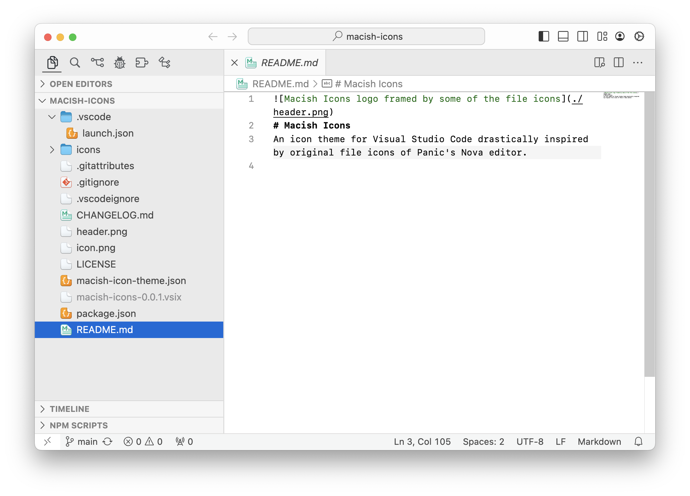

# Macish Icons
An icon theme for Visual Studio Code drastically inspired by original file icons of Panic's Nova editor.

### Why is it versioned with *0.x.x*?
Currently this icon theme is considered as experimental.
Icons might change, be resized or removed for specific file types to avoid visual cluttering.

### Icon requests
At the moment the provided file icons only cover a small area of frontend development.
Maybe you are missing some important icons for your daily development work. Don't hesitate to request icons via the [repository at GitHub](https://github.com/jo-te/macish-icons/issues).

## Screenshot

*Visual Studio Code themed with the [macOS Classic theme](https://github.com/huacnlee/vscode-macos-classic.theme) and __Macish Icons__ for the file icons*